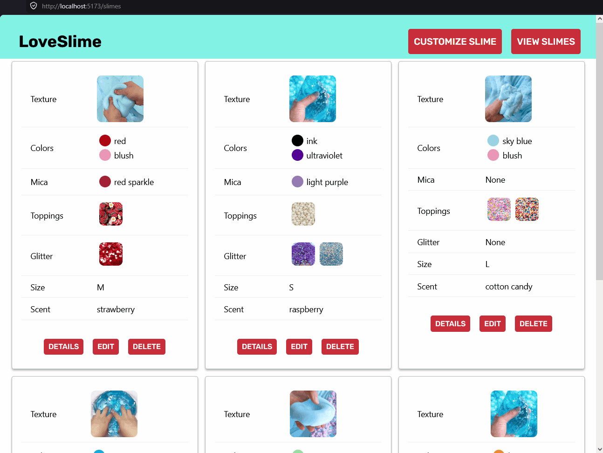
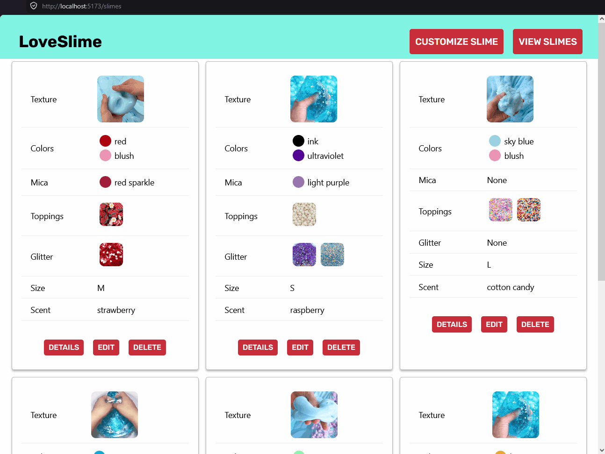
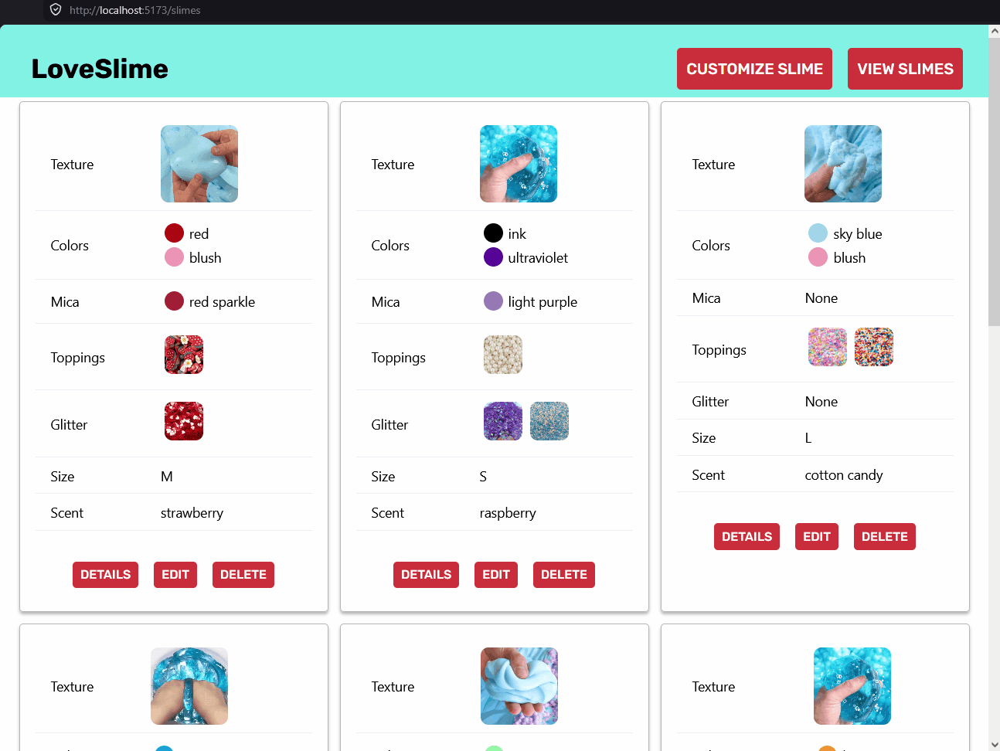
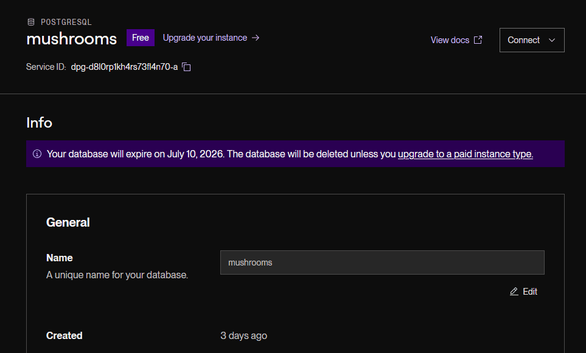
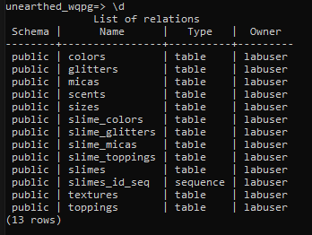
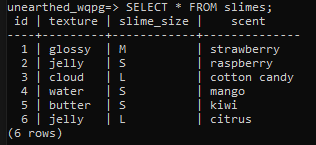
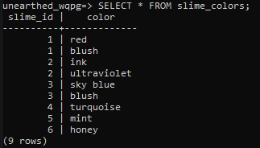
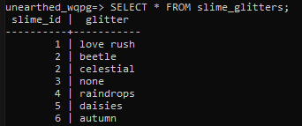
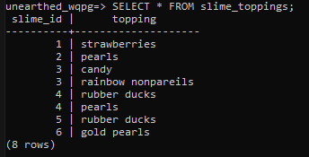
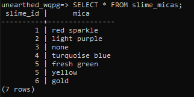

# WEB103 Project 4 - *Custom Slimes*

Submitted by: **Tatiana Vela**

About this web app: **Make custom slimes**

Time spent: **20** hours

## Required Features

The following **required** functionality is completed:

<!-- Make sure to check off completed functionality below -->
- [x] **The web app uses React to display data from the API.**
- [x] **The web app is connected to a PostgreSQL database, with an appropriately structured `CustomItem` table.**
  - [x]  **NOTE: Your walkthrough added to the README must include a view of your Render dashboard demonstrating that your Postgres database is available**
  - [x]  **NOTE: Your walkthrough added to the README must include a demonstration of your table contents. Use the psql command 'SELECT * FROM tablename;' to display your table contents.**
- [x] **Users can view **multiple** features of the `CustomItem` (e.g. car) they can customize, (e.g. wheels, exterior, etc.)**
- [x] **Each customizable feature has multiple options to choose from (e.g. exterior could be red, blue, black, etc.)**
- [x] **On selecting each option, the displayed visual icon for the `CustomItem` updates to match the option the user chose.**
- [x] **The price of the `CustomItem` (e.g. car) changes dynamically as different options are selected *OR* The app displays the total price of all features.**
- [x] **The visual interface changes in response to at least one customizable feature.**
- [x] **The user can submit their choices to save the item to the list of created `CustomItem`s.**
- [x] **If a user submits a feature combo that is impossible, they should receive an appropriate error message and the item should not be saved to the database.**
- [x] **Users can view a list of all submitted `CustomItem`s.**
- [x] **Users can edit a submitted `CustomItem` from the list view of submitted `CustomItem`s.**
- [x] **Users can delete a submitted `CustomItem` from the list view of submitted `CustomItem`s.**
- [x] **Users can update or delete `CustomItem`s that have been created from the detail page.**

The following **optional** features are implemented:

- [x] Selecting particular options prevents incompatible options from being selected even before form submission. the none option is automatically deselected if selecting not none. Other options are deselected when selecting none.

The following **additional** features are implemented:

- [ ] List anything else that you added to improve the site's functionality!

## Video Walkthrough

Here's a walkthrough of implemented required features:

Frontend
Detail page

Create

Edit and delete

Render backend

db contents

GIFs created with [ScreenToGif](https://www.screentogif.com/) for Windows

## Notes

Describe any challenges encountered while building the app or any additional context you'd like to add.
